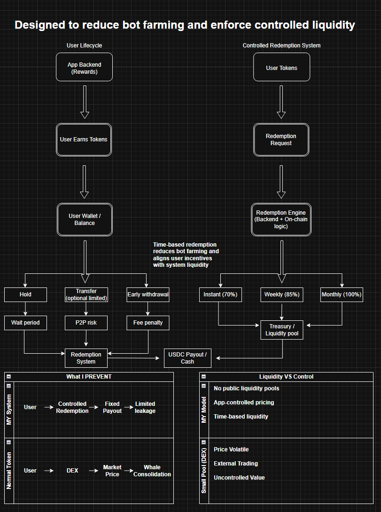

# Controlled Token Economy on Solana (Token-2022)

## Overview

This project explores the design and implementation of a controlled token-based reward system on Solana using Token-2022.

Instead of relying on open market trading, the system introduces a structured redemption model where users earn tokens and redeem them through time-based payout tiers. This approach is designed to reduce bot farming, limit whale consolidation, and enforce controlled liquidity.

## Purpose

The purpose of this project is to explore how systems behave under constrained resources and to design mechanisms that improve stability and prevent misuse. 

Through experimentation with liquidity pools, I observed that low-liquidity environments can lead to unstable and unpredictable behavior. This project addresses that issue by introducing a controlled redemption model that regulates how value is extracted over time.

The goal is to demonstrate how applying constraints and incentive-based design can stabilize a system while maintaining user flexibility.
---

## How It Works

Users interact with the system as follows:

1. Earn tokens through an application backend  
2. Hold tokens in their wallet or account  
3. Redeem tokens through a structured system  

### Redemption Options

- Instant Redemption → 70%  
- Weekly Redemption → 85%  
- Monthly Redemption → 100%  

This incentivizes long-term holding and aligns user behavior with system liquidity.

---

## System Design



---

## Key Concepts Learned

- AMM pricing depends on pool ratios, not token supply  
- Small liquidity pools lead to extreme price volatility  
- Liquidity providers hold a dynamic asset composition  
- Initial price is not fixed in decentralized markets  

---

## Problems Addressed

- Bot farming and rapid extraction of rewards  
- Whale consolidation through unrestricted transfers  
- External market leakage via peer-to-peer trading  
- Uncontrolled token price volatility  

---

## Design Approach

- No public liquidity pools  
- App-controlled pricing model  
- Time-based liquidity distribution  
- Optional restricted transfers to reduce off-platform trading  

---

## Key Insight

This project demonstrates that token value is not determined by supply, but by liquidity and system design. By removing reliance on open market trading and introducing time-based redemption, the system aligns user incentives with controlled liquidity and platform stability.

---

## Technologies Used

- Solana  
- Token-2022  
- SPL Token CLI  
- Raydium (AMM testing)  
- Phantom Wallet  

---

## Future Improvements

- Smart contract for automated redemption logic  
- Transfer restrictions using Token-2022 extensions  
- Frontend dashboard for user interaction  
- Anti-bot detection and account monitoring system  

## Demo: Redemption Simulator

A simple Python script that demonstrates how the time-based redemption model works.

### Run locally

```bash
python redemption_simulator.py
```
### Example

**Input**
```
Tokens: 1000
Days Held: 10
```

**Output**
```
Redemption Tier: Weekly
Rate Applied: 85%
Final Payout: $850
```

